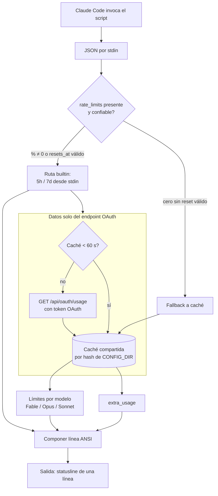
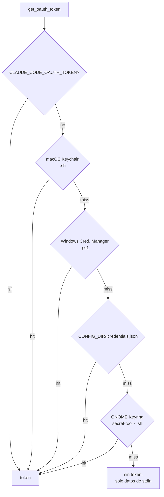

# Diagramas

## Flujo de datos y selección de fuente

```mermaid
flowchart TD
    A[Claude Code invoca el script] --> B[JSON por stdin]
    B --> C{rate_limits presente\ny confiable?}
    C -->|"% ≠ 0 o resets_at válido"| D[Ruta builtin:\n5h / 7d desde stdin]
    C -->|cero sin reset válido| E[Fallback a caché]

    subgraph API[Datos solo del endpoint OAuth]
      F{Caché < 60 s?}
      F -->|no| G[GET /api/oauth/usage\ncon token OAuth]
      G --> H[(Caché compartida\npor hash de CONFIG_DIR)]
      F -->|sí| H
    end

    D --> API
    E --> H
    H --> I[Límites por modelo\nFable / Opus / Sonnet]
    H --> J[extra_usage]

    D --> K[Componer línea ANSI]
    I --> K
    J --> K
    K --> L[Salida: statusline de una línea]
```

## Resolución del token OAuth

```mermaid
flowchart TD
    A[get_oauth_token] --> B{CLAUDE_CODE_OAUTH_TOKEN?}
    B -->|sí| Z[token]
    B -->|no| C{macOS Keychain\n.sh}
    C -->|hit| Z
    C -->|miss| D{Windows Cred. Manager\n.ps1}
    D -->|hit| Z
    D -->|miss| E{CONFIG_DIR/.credentials.json}
    E -->|hit| Z
    E -->|miss| F{GNOME Keyring\nsecret-tool · .sh}
    F -->|hit| Z
    F -->|miss| Y[sin token:\nsolo datos de stdin]
```
